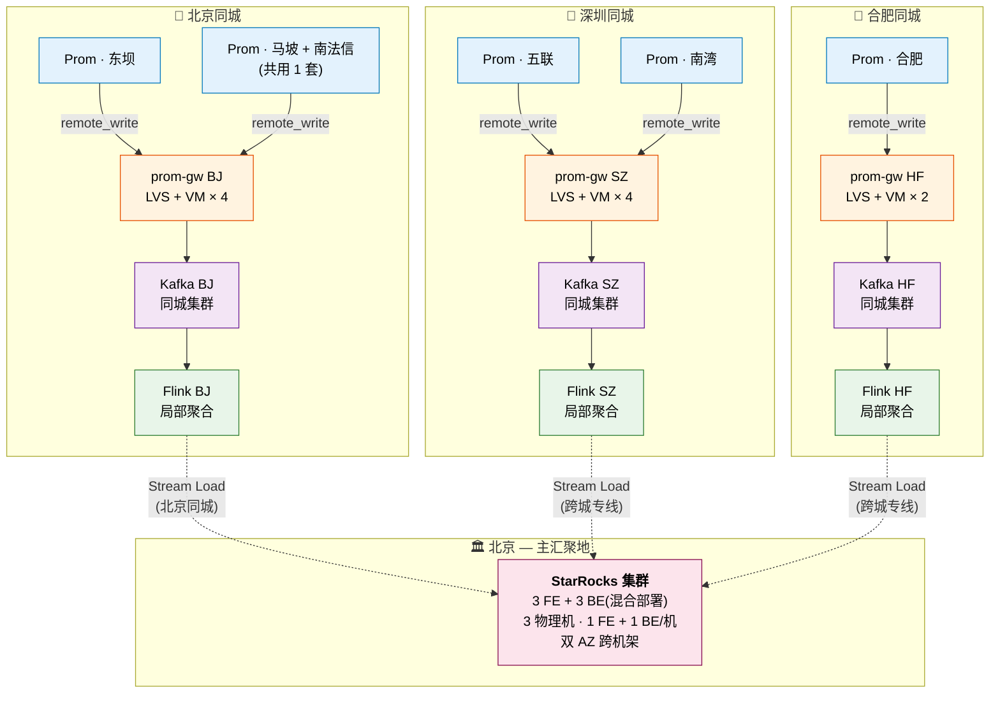
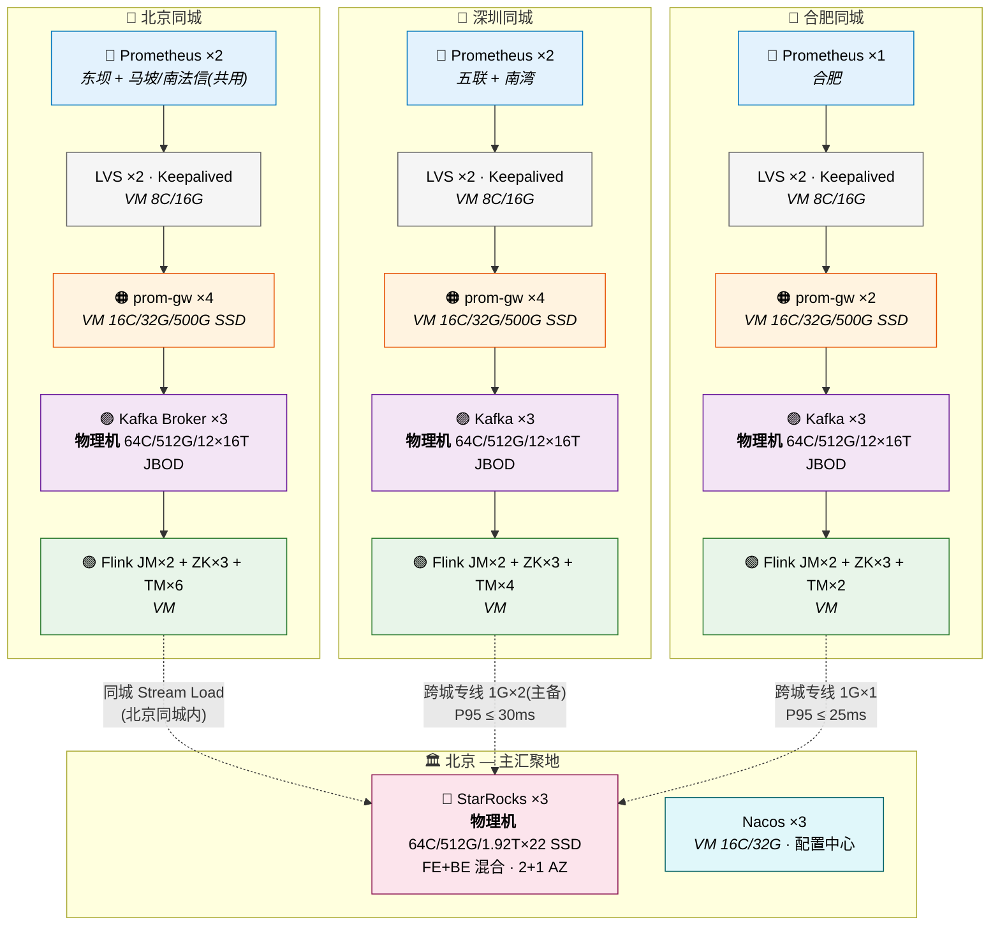

# 多机房 Prometheus 采集到数据中台方案设计

- **Status**: Draft
- **Date**: 2026-07-28
- **Author**: Brainstorming
- **Repo**: `github.com/lynnyq/bigdata`

## 1. 背景与目标

业务在三个城市的多机房部署 Prometheus,通过 `remote_write` 上报指标:

| 城市 | 机房                          | 用途     |
| -- | --------------------------- | ------ |
| 北京 | 东坝                          | 北京业务   |
| 北京 | 马坡 + 南法信(共用 1 套 Prometheus) | 北京业务   |
| 深圳 | 五联、南湾                       | 深圳业务   |
| 合肥 | 合肥                          | 异地容灾业务 |

三地共 5 套 Prometheus 集群(北京 2 套:东坝独立 1 套 + 马坡/南法信共用 1 套;深圳 2 套:五联/南湾各 1 套;合肥 1 套),各自采集本地业务指标后,通过 `remote_write` 上报到本地 `prom-gw` 网关,再经过同城 Kafka → 同城 Flink 聚合,最终统一写入部署在北京的 StarRocks 集群,供全公司统一查询分析。

**目标**:自研 RemoteWrite 协议网关(`prom-gw`),作为多机房 Prometheus 与数据中台之间的统一接入层,提供:

- 高吞吐(单机 ≥ 1.5M samples/s 持续)
- 多租户路由、按业务分 topic
- 标签/指标/采样/下采样/死值等多维清洗
- 同城采集、同城计算、跨城汇聚到北京 StarRocks
- 配置热更新
- 端到端可观测(三地 trace 串联)

## 2. 整体架构

整体采用「三地同城采集、同城聚合、跨城汇聚」的三级分层架构:三地分别独立完成采集、清洗与局部聚合,最终统一写入部署在北京的 StarRocks 集群。

### 2.1 架构总览



**图例说明**

- 实线 = 同城数据流(remote\_write / Kafka 写入 / Flink 消费)
- 虚线 = 跨城 / 跨层 Stream Load(北京 Flink 同城内,深圳/合肥 Flink 跨城专线)
- 颜色:🔵 Prometheus  🟠 prom-gw  🟣 Kafka  🟢 Flink  🔴 StarRocks

**控制面与可观测**

- 控制面:Nacos(北京主集群 + 异地只读同步)←→ Admin API(每城部署)
- 可观测:每城 `prom-gw` self-exporter → 北京统一 Prometheus 联邦 → Grafana

### 2.2 物理部署图

> **5 套 Prometheus 已在生产环境运行**(北京东坝独立 1 套 + 北京马坡/南法信共用 1 套 + 深圳五联 1 套 + 深圳南湾 1 套 + 合肥 1 套),本图为新建 `prom-gw` / Kafka / Flink / StarRocks 等组件的物理/虚拟资源规划。

#### 2.2.1 总体拓扑



**图例说明**

- 实线 = 同城数据流(`remote_write` → LVS → `prom-gw` → Kafka → Flink)
- 虚线 = Stream Load 写入 StarRocks(北京同城内;深圳/合肥走跨城专线)
- **物理机**:Kafka Broker、StarRocks FE+BE(IO 密集 / 大内存);其余角色均为虚拟机
- 颜色:🔵 Prometheus  🟠 prom-gw  🟣 Kafka  🟢 Flink  🔴 StarRocks  ⚪ LVS/Nacos
- 跨城仅传 **5 min 聚合主体**(三城合计 1 TB/天,占 1G 专线 9.3%);1 h / 1 d 聚合由 StarRocks **独立物理表 + 周期任务级联聚合**维护,不跨城;**15s 原始 sample 明细严禁跨城**(§2.2.6)

#### 2.2.2 资源清单(单台规格 × 数量)

> **配套设计(三独立表 + 级联聚合方案)**:Flink 输出**仅 5 min 聚合跨城**(每城 345 GB/天 gzip 压缩后,三城 1 TB/天,占 1G 专线 9.3%);1 h / 1 d 聚合由 StarRocks **周期任务**从 5m / 1h 表级联聚合,**不跨城**;**Kafka 3 天留存 + 3 副本 + 65% 上限,JBOD 12 × 16T/节点**(64C/512G 物理机,§2.2.6);StarRocks **三张独立物理表** `sr_bj_metrics_5m`(7 天)+ `sr_bj_metrics_1h`(90 天)+ `sr_bj_metrics_1d`(3 年),3 副本物理 ≈ 46.35 T(无需扩容)。
>
> **为何不用 ROLLUP**:ROLLUP 物化视图与基础表**共享分区生命周期**,基础表分区被 drop(如 5m 表 7 天清理)时,该分区的 `rollup_1h` / `rollup_1d` 数据**一起被删除**,无法实现"5m 存 7 天、1d 存 1 年"的多 TTL 需求。因此采用三张独立物理表,各自管理 `dynamic_partition` 生命周期,互不影响。

| 角色 | 形态 | 单台规格 | 数量(北京/深圳/合肥) | 小计 | 备注 |
|---|---|---|---|---|---|
| **LVS (Keepalived)** | 虚拟机 | 8C/16G/200G | 2 / 2 / 2 | **6** | 每机房 2 台主备 |
| **prom-gw** | 虚拟机 | 16C/32G/500G SSD | 4 / 4 / 2 | **10** | `prom-gw@<city>-<instance>.service`(如同城 4 台:`bj-1`/`bj-2`/`bj-3`/`bj-4`) |
| **Kafka Broker (KRaft)** | 物理机 | 64C/512G/**12 × 16T HDD JBOD** | 3 / 3 / 3 | **9** | 3 副本,**3 天留存 + 65% 上限**;每节点 192T,裸盘 576T / 576T / 576T |
| **Flink JobManager** | 虚拟机 | 32C/64G/1T | 2 / 2 / 2 | **6** | 1 Active + 1 Standby,ZK 选主 |
| **Flink Zookeeper (HA)** | 虚拟机 | 8C/16G/200G | 3 / 3 / 3 | **9** | 3 节点 ensemble,容 1 故障 |
| **Flink TaskManager** | 虚拟机 | 16C/32G/500G SSD | 6 / 4 / 2 | **12** | 每 TM 4 task slot;运行 L2a 5min 聚合(1 h / 1 d 聚合由 StarRocks 周期任务级联维护,Flink 不持有状态) |
| **StarRocks 混合节点 (FE+BE)** | 物理机 | 64C/512G/**1.92T × 22 SATA SSD** | 3 (全在北京) | **3** | 每节点 1 FE + 1 BE 共进程;FE-1/FE-2/FE-3 均 Follower(3 Follower 容忍 1 故障,多数派 2/3);BE × 3 双 AZ 均衡 3 副本;**裸盘 42.24T/机,BE 18 盘 ≈ 34.56T;5m 表 7d + 1h 表 90d + 1d 表 3y 合计 3 副本 ≈ 46.35 T 物理** |
| **Nacos** | 虚拟机 | 16C/32G/1T | 3 (北京主 + 异地只读) | **3** | MySQL 后端独立集群 |

**Kafka 磁盘选型对比**(JBOD vs RAID10):

| 维度 | **JBOD ✅ 推荐** | RAID10 |
|---|---|---|
| 单节点磁盘配置 | 12 × 16T | 24 × 16T(12 mirror) |
| 单节点裸盘 | 192T | 384T |
| 单节点有效容量 | 192T(无 RAID 开销) | 192T(50% 镜像开销) |
| 3 节点城市裸盘 | 576T | 1152T(2× JBOD) |
| 65% 上限下可用 | 374.4T | 374.4T(同等可用) |
| 单盘故障 | 丢该盘 1 副本,2 副本仍可用,Kafka 自动补 | 镜像盘接管,无数据丢失 |
| Kafka 适配 | ✅ 3 副本已提供 RAID10 同等冗余 | ⚠️ 与应用层 3 副本叠加,**过度设计** |
| 成本(3 节点城) | **1×** | **2×** |
| 运维复杂度 | 低(磁盘独立更换) | 中(RAID 控制器 / 重建) |
| IO 并行度 | **12 个盘并发**(更高) | 12 个盘(条带化) |

**Kafka 裸盘核算**(JBOD · 3 天留存 · 3 副本 · 65% 上限):

| 资源 | 单城(BJ) | 单城(SZ) | 单城(HF) | 跨城总 |
|---|---|---|---|---|
| Broker 数 | 3 | 3 | 3 | — |
| 每节点 JBOD | 12 × 16T | 12 × 16T | 12 × 16T | — |
| 每节点裸盘 | 192T | 192T | 192T | — |
| **裸盘总容量** | **576T** | **576T** | **576T** | — |
| 65% 可用容量 | 374.4T | 374.4T | 374.4T | — |
| **3 天留存需求** | 180T | 180T | 180T | — |
| 头空间 | 52% | 52% | 52% | — |
| Flink TM 总核数 | 6 × 16 = 96 核 | 4 × 16 = 64 核 | 2 × 16 = 32 核 | 192 核 |
| 跨城 5min 聚合写入量(gzip) | 345 GB/天 | 345 GB/天 | 345 GB/天 | **1.0 TB/天(三城)** |
| 跨城带宽配额 | 1G | 1G | 1G | 1G/单城 |
| 跨城带宽占用 | 3.2% | 3.2% | 3.2% | 9.3%(三城合计) |

<br />

#### 2.2.3 北京机架布局 (双 AZ)

| 机架 | 用途 | 设备 |
|---|---|---|
| **Rack-A1** (AZ-1) | StarRocks 混合节点 | SR-1 (1 FE + 1 BE) + SR-2 (1 FE + 1 BE) |
| **Rack-A2** (AZ-2) | StarRocks 混合节点 | SR-3 (1 FE + 1 BE) + 备件 1U |
| **Rack-B1** (AZ-1) | Kafka + Flink | Kafka-1/2 + BJ-Flink-JM ×2 + TM-1/2/3 |
| **Rack-B2** (AZ-2) | Kafka + Flink + Nacos | Kafka-3 + TM-4/5/6 + Nacos ×3 |
| **Rack-C**         | 网络 + LVS            | BJ-LVS ×2 + 跨城专线路由器 ×2 + Tor 交换机 |

#### 2.2.4 网络与互联

- **Prom → LVS**:10G 同城 LAN,Prometheus `remote_write` 到 LVS VIP(LVS 双节点主备走 Keepalived)
- **LVS → prom-gw**:内网 10G,LVS DR 模式直接转发
- **prom-gw → Kafka**:10G 内网,Kafka `advertised.listeners` 绑定内网 VIP
- **Flink → StarRocks**:走 HTTP `8030` Stream Load(FE `http_port`),FE VIP 负载均衡
- **跨城专线**(1G 共享池,无 10G):
  - 深圳 ⇄ 北京:**主 + 备 2 条 1Gbps** 专线,BGP 冗余;**项目配额 1G**(整个共享池上限)
  - 合肥 ⇄ 北京:**1 条 1Gbps** 专线(单线,故障时降级本地 ClickHouse);**项目配额 1G**
  - 专线时延 P95:深圳 ⇄ 北京 ≤ 30ms,合肥 ⇄ 北京 ≤ 25ms
  - **流量整形**:跨城流量走 FE VIP 限速(令牌桶,<= 1G),本地查询流量不抢占;**原始 sample 明细(15s)严禁走跨城**(§2.2.6 监控告警)
- **Nacos 配置推送**:HTTPS 长轮询,Nacos Master(北京) → 三地 prom-gw

#### 2.2.5 关键约束

1. **物理机 vs 虚拟机选择**:
   - **物理机**:Kafka Broker、StarRocks FE / BE(IO 密集 / 大内存 / 稳定低开销)
   - **虚拟机**:LVS、prom-gw、Flink JobManager / TaskManager、Nacos、Zookeeper(弹性扩缩,统一镜像)
2. **本地 SSD 强制**:StarRocks BE / Kafka OS 盘 / Flink TM 状态盘 必须 SSD(**本场景无 NVMe,StarRocks BE 用 18 × 1.92T SATA SSD / 机(22 盘位机箱占用 22 盘,2 盘 RAID 1 给 OS,2 盘 RAID 1 给 FE,18 盘 JBOD 给 BE)**;Flink TM 状态盘可用 SATA SSD;Kafka OS 盘用 SATA SSD)
3. **跨机架分布**:Kafka 3 Broker 按 `2+1` 分布在 2 个 AZ(AZ-1 部署 Kafka-1/2,AZ-2 部署 Kafka-3),StarRocks BE 3 节点按 `2+1` 分布在 2 个 AZ(AZ-1 部署 SR-1/SR-2,AZ-2 部署 SR-3)
4. **时间同步**:全集群 `chrony` 对齐北京 NTP 源(北斗 + GPS),保证 timestamp 一致
5. **机架功耗**:单 Rack 规划 12kW,StarRocks 物理机单台 800W,需保证 UPS + 双路市电
6. **Flink JobManager 高可用**:
   - 每城部署 **1 Active JM + 1 Standby JM**(2 节点),通过 ZK leader election 切换
   - ZK ensemble **3 节点**(奇数,容 1 故障),与 JM 跨机架部署,避免单机柜故障整体不可用
   - **状态后端**:RocksDB + HDFS/S3 增量 Checkpoint(默认 1min),保证故障恢复时不丢数据
   - **故障切换时延**:Active JM 异常 → Standby JM 接管 < 30s(无状态任务)/ < 2min(包含 Checkpoint 加载)
   - **重启策略**:固定延迟重启 3 次(间隔 10s),第 3 次仍失败则告警人工介入
   - **关键状态**:作业 `state.checkpoints.dir` 与 `state.savepoints.dir` 落本城 HDFS,异地不依赖
   - 旧版 `1 个 JM` 方案已废弃——单点故障会导致全城 Flink 任务中断,分钟级 RTO + 状态回放

#### 2.2.6 容量校核

> 输入假设:**每城 30 T/天 Prometheus 远端写入(snappy 压缩后口径)**,全链路贯穿 `prom-gw → Kafka → Flink → StarRocks`。本节核算各环节磁盘需求是否匹配 §2.2.2 资源清单。
>
> **关键设计(三独立表 + 级联聚合方案,见 §4.5 / §4.6)**:Flink 在本城完成 5 min 滚动聚合,**仅 5 min 主体跨城写入北京 StarRocks `sr_bj_metrics_5m`**;**1 h / 1 d 聚合通过 StarRocks 周期任务(INSERT INTO ... SELECT)从 5m / 1h 表级联聚合**,写入独立物理表 `sr_bj_metrics_1h` / `sr_bj_metrics_1d`,各自管理分区 TTL,互不影响。这使 StarRocks 同时具备 5 min 精度告警(7 天)+ 1 h 趋势(90 天)+ 1 d 长期报表(3 年)能力,跨城流量与磁盘代价在可接受范围。
>
> **为何不用 ROLLUP**:ROLLUP 与基础表共享分区生命周期,基础表分区 drop 时 ROLLUP 数据一并删除,无法实现"5m 存 7 天、1d 存 1 年"的多 TTL。三独立表 + 周期任务是业界多 TTL 的标准做法。

##### (1) 数据量基础换算

| 项 | 值 | 说明 |
|---|---|---|
| **单城 Prometheus 远端写入** | **30 T/天 = 30 720 GB/天** | **snappy 压缩后 on-wire 口径**(即 `prom-gw` 实际接收的字节数) |
| 平均吞吐 | ≈ 355 MB/s | `30T / 86400s` |
| 日间峰值(按 3× 均值) | ≈ 1.05 GB/s | 业务高峰 09:00–21:00 |
| 解压后原始样本量 | ≈ 60–90 T/天 | snappy 对 protobuf 压缩比约 2–3× |
| `prom-gw` → Kafka(zstd 再压缩后) | **≈ 18–22 T/天** | 透传 `WriteRequest` protobuf(模式 1,§4.3),`compression.type=zstd` 较 snappy 额外压缩 1.3–1.7× |
| L2a 5 min 聚合(单城,逻辑未压缩) | **≈ 660 GB/天** | 1000 万 series × 288 行/天 × 230 B/行(CSV/JSON 未压缩) |
| L2a 5 min 聚合(单城,Stream Load gzip 压缩后) | **≈ 345 GB/天** | Stream Load 启用 HTTP `Content-Encoding: gzip`,压缩比 ~1.9×,实际跨城传输字节 |
| L2b 1 h 聚合独立表(单城) | ≈ 22 GB/天 | StarRocks 周期任务从 5m 表级联聚合,无独立 Flink 输出 |
| L2c 1 d 聚合独立表(单城) | ≈ 0.7 GB/天 | StarRocks 周期任务从 1h 表级联聚合,无独立 Flink 输出 |
| **5 min 跨城(单城,gzip 压缩后)** | **≈ 345 GB/天** | Stream Load HTTP gzip 压缩传输,实际占用专线带宽 |
| **5 min 跨城(三城合计)** | **≈ 1.0 TB/天** | bj + sz + hf 并发上传北京 |
| **跨城平均带宽** | **≈ 12 MB/s** | 1 TB / 86 400 s,占 1G 专线配额 9.3% |
| **跨城峰值带宽** | **≈ 36 MB/s** | 3× 均值,Stream Load 突发,占 1G 专线 28% |

**重要变更**:相对原"仅日聚合跨城"方案(8.7 GB/天,占 1G 专线 0.08%),三独立表方案**跨城流量增加 119×**(1000/8.7),**1G 专线利用率从 0.08% 涨到 9.3%**。**降级路径**:若 1G 专线确实紧张,Flink 端可降级为只推送 1 h / 1 d 聚合(由周期任务级联维护),跨城流量回落到 70 GB/天(0.65%),代价是失去 5 min 精度的跨城告警/事故复盘能力。

##### (2) Flink 磁盘 ✅ 充足

Flink 角色是**流式计算**,**不持久化原始 30 T 数据**;其磁盘仅服务于:

| 用途 | 单 TM 占用 | 6 TM 合计 | 是否够 |
|---|---|---|---|
| **L2a 5 min 滚动 State**(RocksDB,含 t-digest) | 80–150 GB | 480–900 GB | ✅(见下) |
| **L2b 1 h 级联聚合**(StarRocks 周期任务维护,Flink 不持有) | 0 GB | 0 GB | — |
| **L2c 1 d 级联聚合**(StarRocks 周期任务维护,Flink 不持有) | 0 GB | 0 GB | — |
| **Checkpoint / Savepoint**(本地落盘 + 异步推 HDFS) | 50 GB | 300 GB | ✅ |
| **TaskManager 日志 + tmp** | 10 GB | 60 GB | ✅ |
| **总计** | **≈ 140–210 GB/TM** | **≈ 840–1260 GB** | **资源清单 6 × 500G SSD = 3 T,需调优 t-digest compression 后充足** |

**State 大小估算(关键)**:

```
活跃时间序列 ≈ 1 000 万
单 series 状态:  key(metric+labels_hash) ≈ 200 B
                 聚合中间值(sum/count/max/min/avg) ≈ 40 B(5 个 double)
                 t-digest 结构(p50 + p99 合并) ≈ 2-4 KB(压缩参数 100 compression)
单 series state ≈ 200 + 40 + 3000 ≈ 3.2 KB(含 t-digest)
总 state ≈ 1e7 × 3.2 KB ≈ 32 GB(纯内存)
RocksDB 落盘 ≈ 32 × 2.5(含 SST/索引/WAL) ≈ 80 GB
```

> **为何 t-digest 开销大**:5m 表 schema 含 `value_p50` / `value_p99`(§4.5),Flink 必须在窗口内计算分位数。p50/p99 不具备线性可加性,需用 t-digest 近似结构保存样本分布;单个 t-digest(compression=100)state 约 1-2 KB,两个分位数合并约 2-4 KB/series。若改用"保存全部 20 个原始 sample 再计算分位",state 约 20 × 24B = 480 B/series(更小但无法增量合并,且窗口内 sample 数波动时 state 不稳定)。本设计选用 t-digest 以支持后续 1h/1d 级联聚合时的跨窗口合并。

即使按 10× 保守系数预留(异常窗口/扩缩容),单 TM state 可达 800 GB,**超出 500 GB SSD 规格**。实际建议:(1) t-digest `compression` 调到 50(state 减半至 ~16 GB,10× 后 160 GB,500 GB 够用);(2) 按 tenant 分拆多个 Flink 作业降低单 TM state 压力;(3) RocksDB 增量 checkpoint + 异步推 HDFS,本地仅保留最近 2 个 checkpoint。

**L2a 5 min 跨城聚合的特别说明**:5 min 滚动是基于原始 sample(15s 一次,窗口内 20 个 sample)直接计算,触发时**仅 Stream Load 当前 5 min 窗口的 1 批数据**(单城 1000 万 series ≈ 230 B/行 × 1000w = 2.3 GB/批,288 批/天)。state 中保存 5 min 窗口内的 sample 累积值,5 min 触发后**状态清零**(滚动窗口),state 大小可控。

**结论**:Flink 磁盘在 t-digest `compression=50` 调优后充足(单 TM ~160 GB state + 50 GB checkpoint + 10 GB 日志 ≈ 220 GB < 500 GB);默认 `compression=100` 下需按 tenant 拆分作业或扩 TM 数。**瓶颈在 t-digest state,非原始数据落盘**。

##### (3) Kafka 磁盘 ✅ 满足 3 天留存 + 65% 上限(JBOD 方案)

> **约束**:3 天留存 × 3 副本 × 65% 磁盘使用率上限。
> **需求**:zstd 压缩后 **20 T/天** × 3 天 × 3 副本 = **180T 原始占用**;`180T / 0.65 = 277T` 为裸盘下限。

**数学推导**:

```
单城日均落 Kafka      = 30 T/天(snappy) × zstd 压缩 → ≈ 20 T/天(逻辑)
3 天留存逻辑数据       = 20 × 3 = 60 T
3 副本原始占用         = 60 × 3 = 180 T
65% 上限反推裸盘下限    = 180 / 0.65 = 277 T(每城)
```

**JBOD 方案(推荐)**:三城统一 3 Broker × 12 × 16T,裸盘 576T/城(详见 §2.2.2)

| 城市 | 现状(裸盘) | 3 副本后**实际占用**(3 天) | 65% 可用容量 | 余量 | 评估 |
|---|---|---|---|---|---|
| **北京** | 3 × 12 × 16 T = **576 T** | 180 T | 374.4 T | **+194.4 T(52%)** | ✅ 充裕(三城统一) |
| **深圳** | 3 × 12 × 16 T = **576 T** | 180 T | 374.4 T | **+194.4 T(52%)** | ✅ 充裕 |
| **合肥** | 3 × 12 × 16 T = **576 T** | 180 T | 374.4 T | **+194.4 T(52%)** | ✅ 充裕 |

**JBOD vs RAID10 对比**(同 3 天需求 180T):

| 维度 | **JBOD ✅ 推荐** | RAID10 |
|---|---|---|
| 3 节点城每节点磁盘 | 12 × 16T | 24 × 16T(12 mirror) |
| 3 节点城裸盘 | 576T | 1152T |
| 3 节点城 65% 可用 | 374.4T | 374.4T(同等) |
| 单盘故障行为 | 丢 1 副本,Kafka 自动从 2 副本补齐 | 镜像盘接管,无丢失 |
| 冗余来源 | Kafka 应用层 3 副本 | 硬件 RAID10 + Kafka 3 副本(双层) |
| 成本 | **1×** | **2×**(1152T 裸盘) |
| 写性能 | 标准顺序写 | 1× 写(镜像同步) |
| 读性能 | 标准顺序读 | **2× 读(条带化)** |
| 适用 Kafka | ✅ **标准做法** | ⚠️ 过度设计,容量浪费 50% |

**RAID10 仅在以下场景才优于 JBOD**:

- 业务层副本数 < 3(只有 1–2 副本,需硬件兜底)
- 极致读性能需求(如多 consumer 并发读历史 segment)
- 合规要求"硬件级 RAID 冗余"

本方案 Kafka 已 3 副本,**RAID10 与应用层冗余叠加,无收益**——选 JBOD。

**关键设计决策**:

- ✅ **JBOD**:12 × 16T/节点(每盘独立,JVM/进程感知单盘,192T/节点)
- ✅ `log.dirs` 配置为 12 个挂载点(每盘一个目录)
- ✅ Kafka 8.x+ 默认开启 per-disk IO 隔离(`num.replica.fetchers` 自动调优)
- ✅ 监控告警:单盘使用率 > 55% 警告,> 65% 严重(预留 10% 给 Kafka 自身 compaction)
- ✅ 备选:采用 **Kafka Tiered Storage**(KIP-405,Kafka 3.6+ GA),Flink 消费热段,冷段自动卸载 S3/OSS

##### (4) StarRocks 磁盘 ✅ **完全够用,无需扩容**

> 三独立表方案下,**5 min 主体跨城写入量 1 TB/天**,5m 表 7 天 + 1h 表 90 天 + 1d 表 3 年,单副本合计 15.45 TB,3 副本物理 46.35 TB,占 BE 总盘 44.7%,**充裕**。
>
> **新约束**:StarRocks 混合部署,**仅 3 台物理机**(每机 1 FE + 1 BE),单机规格 **64C/512G/1.92T × 22 SATA SSD**(裸盘 42.24T,**无 NVMe**)。

**单机资源分配**(1 FE + 1 BE · 22 盘):

| 进程 | CPU | 内存 | 磁盘 | 说明 |
|---|---|---|---|---|
| **FE × 1** | 8C | 16G | 2 × 1.92T(RAID 1) = 1.92T 可用 | 元数据 + audit log;FE-1/FE-2/FE-3 均 Follower(3 Follower 容忍 1 故障);jemalloc heap 8G + meta cache |
| **BE × 1** | 48C | 464G | 18 × 1.92T = **34.56T**(JBOD) | 数据存储 + 计算;memtable 16G + page cache 占用大部分内存;tablet meta 占用部分盘 |
| OS / 系统盘 | 8C | 32G | 2 × 1.92T(RAID 1) = 1.92T 可用 | OS + JDK + FE/BE 日志 + 监控 agent + tmp |
| **单机合计** | **64C** | **512G** | **22 × 1.92T = 42.24T** | 整机 2U 高密度,24 盘位机箱占用 22 盘(留 2 盘位备件) |

**集群规模(3 机 · 1 FE + 1 BE/机 · 22 盘/机)**:

| 项 | 数值 |
|---|---|
| 物理机数 | 3(全在北京) |
| FE 总数 | 3(FE-1/FE-2/FE-3 均 Follower,容忍 1 故障) |
| BE 总数 | 3(每机 1 个 BE 进程) |
| 集群总物理盘 | 3 × 22 × 1.92T = **126.72T** |
| OS 占用(RAID 1) | 3 × 2 × 1.92T = 11.52T(2 盘/机) |
| FE 占用(RAID 1) | 3 × 2 × 1.92T = 11.52T(2 盘/机) |
| **BE 数据盘(JBOD)** | 3 × 18 × 1.92T = **103.68T**(18 盘/机) |
| 单 BE 可用盘 | ≈ 30T(34.56T 扣除 4.5T compaction 临时 / tablet meta / WAL) |
| **3 副本下每 BE 实际占用** | **≈ 15.45T**(每 BE 持有一份完整副本) |
| **集群总物理数据(3 副本)** | **≈ 46.35T** |
| BE 集群磁盘利用率 | 46.35 / 103.68 = **44.7%** ✅ 充裕 |

**容量校核**(三独立表 · 5m 7d + 1h 90d + 1d 3y):

| 项 | 估算 | 说明 |
|---|---|---|
| 5m 表单行 | ≈ 120 字节 | 见 §4.6.2 |
| 1h 表单行 | ≈ 90 字节 | 见 §4.6.2 |
| 1d 表单行 | ≈ 70 字节 | 见 §4.6.2 |
| 5m 三城日增 | ≈ 1.0 TB | bj + sz + hf 并发 |
| 1h 三城日增 | ≈ 66 GB | 周期任务从 5m 级联聚合 |
| 1d 三城日增 | ≈ 2.1 GB | 周期任务从 1h 级联聚合 |
| **5m 表 7d 单副本(三城)** | **7.2 TB** | 345 GB × 3 城 × 7 天 / 1000 |
| **1h 表 90d 单副本(三城)** | **5.94 TB** | 66 × 90 / 1000 |
| **1d 表 3y 单副本(三城)** | **2.31 TB** | 2.1 × 1095 / 1000 |
| **三表合计单副本** | **15.45 TB** | 7.2 + 5.94 + 2.31 |
| **3 副本总物理** | **46.35 TB** | 15.45 × 3 副本 |
| 每 BE 实际占用 | ≈ 15.45 TB | 3 BE 平摊单副本 |
| 每 BE 可用盘 | 30 TB | 34.56T 裸盘 - 4.5T 元数据/compaction |
| **余量** | **30 - 15.45 = 14.55T(48%)** | ✅ 充裕 |
| 集群总物理占用 | 46.35 TB | 103.68T BE 总盘 / 利用率 44.7% |

**内存约束(64C/512G 紧张)**:

| 进程 | 内存分配 | 用途 |
|---|---|---|
| FE JVM heap | 12G | 元数据 + 查询计划 |
| FE off-heap | 4G |  |
| **BE JVM heap** | **16G** | memtable 写入缓冲 |
| **BE off-heap / page cache** | **~440G** | 数据 page cache(读性能关键) |
| OS + 监控 + agent | 8G |  |
| 预留 / 安全 | ≈ 32G | 防止 OOM 触发 swap |
| **合计** | **≈ 512G** | **512G 整机内存,无 swap 余量** |

⚠️ **注意**:512G 内存分配非常紧张,**`vm.swappiness = 0`** 必须配置;page cache 占用大部分内存,BE 查询性能依赖 OS page cache;BE 内存调优参考 `mem_limit = 480G`(`be.conf`),并开启 `disable_storage_page_cache = false` 复用 page cache。

**CPU 分配(64 核)**:

| 进程 | CPU 分配 | 用途 |
|---|---|---|
| FE | 8C | 元数据管理 + 查询协调 |
| BE | 48C | 数据计算 + compaction + IO |
| OS + 监控 | 8C | systemd / prometheus exporter / agent |
| **合计** | **64C** | **单机物理核数** |

**4 / 5 / 8 年留存扩展性**(1d 表保留期变化,5m 7d + 1h 90d 不变):

| 1d 表保留期 | 1d 单副本(三城) | 5m + 1h + 1d 合计单副本 | 3 副本物理 | 每 BE 占用 | 利用率 |
|---|---|---|---|---|---|
| **3 年(默认)** | 2.31 TB | 15.45 TB | 46.35 TB | 15.45 TB | **44.7%** ✅ |
| **5 年** | 3.85 TB | 16.99 TB | 50.97 TB | 16.99 TB | 49.1% ✅ |
| **8 年** | 6.16 TB | 19.30 TB | 57.90 TB | 19.30 TB | 55.8% ✅ |
| **10 年** | 7.70 TB | 20.84 TB | 62.52 TB | 20.84 TB | 60.3% ✅ |

10 年留存仍可支持(余量 40%),**远超行业典型 3 年要求**。

**磁盘选型对比**(无 NVMe 场景):

| 维度 | **SATA SSD(推荐)** | SATA HDD(降级备选) |
|---|---|---|
| 单 BE 盘配置 | 18 × 1.92T SATA SSD(JBOD) | 18 × 1.92T 7.2K HDD(JBOD) |
| 单 BE 裸盘 | 34.56T | 34.56T |
| 随机读 IOPS | ≈ 50K /盘 | ≈ 100 /盘 |
| 顺序写吞吐 | ≈ 500 MB/s /盘 | ≈ 200 MB/s /盘 |
| Compaction 性能 | ✅ 快速,延迟低 | ⚠️ 慢,小 IO 抖动 |
| 查询 p99 | 50–200 ms | 500–2000 ms(降级) |
| Stream Load 8.7 GB/天 | ✅ 无压力 | ✅ 写入够(但 compaction 积压风险) |
| 3 副本写入放大 | 1× | 1×(但 IOPS 瓶颈) |
| 成本(单 BE 18 盘) | 18 × 1.92T SSD ≈ 较高 | 18 × 1.92T HDD ≈ **低 60%** |
| 适用本场景 | ✅ **推荐** | ⚠️ 仅预算紧张时 |

**决策**:**优先 18 × 1.92T SATA SSD**(单盘读写 IOPS 够,compaction 不积压);若预算/盘位紧张,改用 **18 × 1.92T SATA HDD**(查询响应时间可接受降级,Stream Load 写入量小不影响)。

**关键**:明细数据(15s 原始 sample)**不写入 StarRocks**——所有 1 周内的明细查询走 StarRocks 5 min 表,1 周前的明细查询走本城 Kafka / 本地 OLAP(§4.5 L2a 本地兜底);**5 min / 1 h / 1 d 三层聚合由三张独立物理表提供**,Flink 端只写 5m 表,1h / 1d 由 StarRocks 周期任务级联聚合。

**关于"不存储原始 sample 明细"约束的落实(三独立表方案)**:

- ✅ 表 DDL 定义三张独立物理表 `sr_bj_metrics_5m` / `sr_bj_metrics_1h` / `sr_bj_metrics_1d`,各自管理 `dynamic_partition` 生命周期
- ✅ Flink 端只输出 5 min 聚合,无明细 / 1 h / 1 d 独立 Flink 输出作业
- ✅ 1 h / 1 d 聚合由 StarRocks 周期任务(`INSERT INTO ... SELECT`)级联维护,不依赖 Flink
- ✅ Nacos 配置 / 部署脚本加 lint:禁止跨城 Kafka topic 出现 `*.raw.*` / `*.detail.*` / `*.agg1h.*` 等
- ✅ 跨城流量监控 `flink_cross_dc_bytes_total{topic_class=detail}` 出现 > 0 立即告警

##### (5) 跨城带宽 ✅ **充裕(三独立表方案)**

> 单城跨城配额 **1 Gbps** = **125 MB/s**(十进制口径,日容量 10 800 GB);**5 min 主体三城合计 1 TB/天 ≈ 12 MB/s 平均,峰值 36 MB/s,占 1G 配额 9.3%**,在可接受范围。

| 项 | 数值 | 占 1G 比例 |
|---|---|---|
| **5 min 主体单城日均(gzip 压缩后)** | **345 GB/天** | — |
| **5 min 主体单城日均吞吐** | 345 GB / 86 400 s = **4 MB/s** | 3.2% |
| **5 min 主体三城合计日均** | **1 TB/天** | — |
| **5 min 主体三城日均吞吐** | **12 MB/s** | **9.3%** |
| **5 min 主体三城峰值(3× 均值,Stream Load 突发)** | **36 MB/s** | **28%** |
| 1G 带宽日容量 | 125 MB/s × 86 400 s = **10 800 GB/天** | 100% |
| **5 min 主体单日传输** | **1 000 GB/天** | **9.3%** |

**结论**:1G 跨城带宽**充裕**,三独立表方案下 5 min 主体跨城仅占 9.3% 配额,支持:

- 偶发 DLQ 重放(5 GB/天):占用 < 0.05%
- 紧急跨城数据补传:单次可重传 500 GB+ 仍有富余
- 1 h / 1 d 聚合由 StarRocks 周期任务在本城维护,**不产生跨城流量**

**降级路径**(若 1G 专线实际紧张):

| 方案 | 跨城流量 | 1G 占用 | 代价 |
|---|---|---|---|
| **当前:5 min 主体跨城** | **1 TB/天** | **9.3%** | 跨城查询 5 min 精度 |
| 降级 1:1 h 聚合跨城 | 70 GB/天 | 0.65% | 跨城查询 1 h 精度,失去 5 min 告警能力 |
| 降级 2:1 d 聚合跨城 | 2.1 GB/天 | 0.02% | 跨城查询日级,失去所有分钟级能力 |

降级通过 Flink 端配置切换(改为推送 1h / 1d 聚合结果而非 5m 主体);StarRocks 周期任务仍按各自表精度级联维护,只是 Flink 端少推数据。

**关键约束**(写入文档 §6.2 / §6.4):

- **任何明细 / 原始 sample 不得通过跨城专线**;违反立即触发 P1 告警
- 跨城 Stream Load 走 FE VIP(10.10.10.100:80),与本城内网 10G 严格隔离(避免本城查询抢占跨城带宽)
- 5 min Stream Load 按城市分 Label 并发上传(`bj_5m` / `sz_5m` / `hf_5m`),FE 端做流量整形
- 跨城流量监控 `flink_cross_dc_bytes_total{topic_class=detail}` 出现 > 0 立即告警(防止 Flink 误把原始明细上跨城)

##### (6) 监控与告警阈值

| 指标 | 警告 | 严重 |
|---|---|---|
| **Kafka 单盘使用率**(per disk,JBOD 关键) | > 55% | > 65%(逼近 §2.2.6 (3) 上限) |
| Kafka 集群磁盘使用率(per broker 聚合) | > 50% | > 60% |
| Kafka 入流量 vs 历史 P95 | > 1.2× | > 1.5× |
| Kafka **跨城消费**流量 | > 0 字节 | — |
| Kafka 单盘 GC/Compaction 失败 | > 1 次/小时 | > 5 次/小时 |
| StarRocks BE 磁盘使用率 | > 50% | > 70% |
| **跨城专线利用率** | > 50% | > 80% |
| **L2a 5 min 跨城落 StarRocks 时延** | T+5 min 未落当前窗口 | T+15 min 未落(告警) |
| Flink TM 本地盘 state 目录 | > 200 GB | > 400 GB |
| Flink Checkpoint 失败率 | > 1% | > 5% |

### 2.3 三级分层职责

| 层级      | 城市           | 组件                                        | 职责                              |
| ------- | ------------ | ----------------------------------------- | ------------------------------- |
| L1 同城采集 | 北京 / 深圳 / 合肥 | Prometheus × N                            | 采集本地业务/基础设施指标                   |
| L1 同城接入 | 北京 / 深圳 / 合肥 | prom-gw × N                               | 接入、清洗、规则路由,写入**同城 Kafka**       |
| L2 同城计算 | 北京 / 深圳 / 合肥 | Kafka 同城集群 + Flink JobManager/TaskManager | 局部降采样/聚合/关联,产生同城中转数据            |
| L3 跨城汇聚 | 北京           | StarRocks FE+BE 集群                        | 接收三地 Flink 的 Stream Load,提供统一查询 |

### 2.4 关键设计原则

- **同城自治**:每个城市独立完成「采集→接入→聚合」闭环,跨城链路只承载最终聚合结果,带宽与故障域最小化
- **跨城单向写入**:三地 Flink 仅向北京 StarRocks 写入,不反向回流,避免环路与数据不一致
- **冷热分层**:Flink 聚合后只上传 5 min 聚合主体跨城,原始明细(15s sample)严禁跨城,保留在本地(可对接本城 Kafka / 本地 OLAP 查询)
- **故障隔离**:任一城市故障不影响另外两地,北京 StarRocks 短期不可写时各城 Flink 本地落盘降级

## 3. 组件与职责

### 3.1 接入与计算组件

| 组件            | 部署位置                                     | 职责                                                        | 形态                       |
| ------------- | ---------------------------------------- | --------------------------------------------------------- | ------------------------ |
| Prometheus    | 北京(东坝独立 1 套 + 马坡/南法信共用 1 套)/深圳(五联/南湾)/合肥 | 指标采集、`remote_write` 上报                                    | 原生集群                     |
| Receiver      | 三地 prom-gw                               | HTTP 接入、认证、限流                                             | Stateless                |
| Decoder       | 三地 prom-gw                               | Snappy + Protobuf 解码                                      | Stateless                |
| RuleEngine    | 三地 prom-gw                               | 标签增删改、路由、采样、下采样、死值                                        | Pipeline 多 stage         |
| Router        | 三地 prom-gw                               | 根据 rule 决策路由到同城 Kafka topic                               | Stateless                |
| KafkaProducer | 三地 prom-gw                               | 异步批量写入**同城 Kafka**,幂等,压缩                                  | 共享客户端                    |
| ConfigManager | 三地 prom-gw                               | 加载/热更新规则                                                  | Watcher                  |
| AdminAPI      | 三地 prom-gw                               | 配置 CRUD、Reload、健康检查                                       | gRPC/HTTP                |
| Observability | 三地 prom-gw                               | `/metrics`、`/healthz`、TraceID                             | 内置                       |
| Kafka 同城集群    | 北京/深圳/合肥                                 | 接收 prom-gw 写入,供同城 Flink 消费,3 副本                           | 独立集群                     |
| Flink 集群      | 北京/深圳/合肥                                 | 消费同城 Kafka,做下采样/聚合/关联,产出中转数据,经 Stream Load 写入北京 StarRocks | JobManager + TaskManager |
| StarRocks 集群  | 北京(主)                                    | 接收三地 Flink 的 Stream Load,统一存储与查询;FE+BE 多副本                | 3 FE + 3 BE(混合部署) |

### 3.2 控制面与可观测

| 组件            | 部署位置          | 职责                                |
| ------------- | ------------- | --------------------------------- |
| Nacos         | 北京主 + 异地只读同步  | 配置中心、命名空间(每城独立 namespace)         |
| Admin API     | 三地 prom-gw 内嵌 | 本地规则 CRUD、reload                  |
| Prometheus 联邦 | 北京            | 抓取三地 `prom-gw` self-exporter,统一告警 |
| Grafana       | 北京            | 统一可视化,按 `dc` 标签筛选                 |

## 4. 数据流

### 4.1 接入协议

复用 Prometheus RemoteWrite 标准 v1:

| 项                | 值                                                                         |
| ---------------- | ------------------------------------------------------------------------- |
| HTTP Path        | `/api/v1/write`                                                           |
| Method           | `POST`                                                                    |
| Content-Encoding | `snappy`                                                                  |
| Content-Type     | `application/x-protobuf`                                                  |
| Body             | `prometheus.WriteRequest`                                                 |
| Auth             | `Authorization: Bearer <tenant_token>`                                    |
| Headers          | `X-Prometheus-Remote-Write-Version`, `X-Tenant`, `X-Source-DC`, `TraceID` |

> 新增 `X-Source-DC` 头(Prometheus `external_labels` 注入),标识数据机房(东坝/马坡/南法信/五联/南湾/合肥),用于 `prom-gw` 富化 `source_dc` 标签。

### 4.2 内部流水线

```
[HTTP Request]
    │
    ▼
[Stage 1: Auth & RateLimit]   ← 100K samples/s/instance
    │ WriteRequest
    ▼
[Stage 2: Decode]             ← Snappy → Protobuf
    │ WriteRequest struct
    ▼
[Stage 3: Parse]              ← TimeSeries → Internal Sample
    │ []Sample
    ▼
[Stage 4: RuleEngine Pipeline]
    │ 4.1 Relabel (label drop/keep/map)
    │ 4.2 Enrich   (region, env, dc, project, source_dc)
    │ 4.3 Route    (decide target topic)
    │ 4.4 Sample   (random drop)
    │ 4.5 Downsample (1m→5m aggregation)
    │ 4.6 DeadValue (drop unchanged series)
    ▼
[Stage 5: BatchBuffer per Topic]
    ▼
[Stage 6: Async Kafka Producer] ──▶ 同城 Kafka 集群
    ▼
[200 OK → Prometheus]
```

每个 stage 是一个 goroutine pool,阶段间用**有界 channel**(默认 65535)解耦。流水线输出**仅落到本地 Kafka 集群**,不直接跨城。

### 4.3 Kafka 数据格式

支持两种模式(规则配置选择):

- **模式 1:RemoteWrite 透传** - 透传 `WriteRequest` Protobuf,加 envelope (`tenant`, `source_dc`, `ingest_time_ms`, `ingest_dc`)
- **模式 2:JSON Lines** - `{metric, labels, value, timestamp_ms, tenant, dc, source_dc}[]`

默认模式 1。Envelope 中 `ingest_dc` 标识本条数据由哪座城市的 prom-gw 写入(便于 Flink/StarRocks 端追溯)。

### 4.4 Topic 命名

同城 Kafka 内按城市分 namespace(topic 前缀包含城市),避免跨城运维误操作:

```
prom.bj.raw.<tenant>          # 北京原始
prom.bj.cleaned.<tenant>      # 北京清洗后
prom.bj.routed.<business>     # 北京按业务路由
prom.bj.agg.<business>        # 北京 Flink 聚合输出(供同城查询)

prom.sz.raw.<tenant>          # 深圳原始
prom.sz.cleaned.<tenant>
prom.sz.routed.<business>
prom.sz.agg.<business>

prom.hf.raw.<tenant>          # 合肥原始
prom.hf.cleaned.<tenant>
prom.hf.routed.<business>
prom.hf.agg.<business>
```

每个 topic 默认 64 个分区(可在 config 中按 topic 覆盖),分区 key = `hash(tenant + metric_name + sorted_labels_hash)`,保证同 series 顺序写。

### 4.5 Flink 同城聚合 + 跨城写入(三独立表 + 级联聚合)

每城 Flink 独立运行,消费本城 Kafka 的 `prom.<city>.cleaned.*` / `prom.<city>.routed.*`,**完成 5 min 滚动聚合后跨城写入北京 StarRocks `sr_bj_metrics_5m` 表**;**1 h / 1 d 聚合由 StarRocks 周期任务(INSERT INTO ... SELECT)从 5m / 1h 表级联聚合,写入独立物理表 `sr_bj_metrics_1h` / `sr_bj_metrics_1d`,不再由 Flink 端独立输出**。

> **为何不用 ROLLUP(重要纠正)**:ROLLUP 物化视图与基础表**共享分区生命周期**——当 `sr_bj_metrics_5m` 的某个分区被 drop(如 7 天清理),该分区对应的 `rollup_1h` / `rollup_1d` 数据**一起被删除**。因此"5m 存 7 天、1d 存 1 年"的多 TTL 需求**在 ROLLUP 模型下无法实现**。业界标准做法是**三张独立物理表**,各自管理 `dynamic_partition` 生命周期,通过周期任务级联聚合,互不影响。

**关键设计**:
- ✅ **5 min 聚合主体跨城**(从本城到北京),支撑实时大屏/告警/事故复盘
- ✅ **1 h / 1 d 聚合由 StarRocks 周期任务级联维护**(INSERT INTO ... SELECT),Flink 端无需额外作业、无重复写
- ✅ **写入路径单一**:Flink → Stream Load → 5m 表;1h / 1d 表由周期任务填充
- ✅ **多 TTL 独立**:5m 表 7 天、1h 表 90 天、1d 表 3 年,各自 `dynamic_partition` 独立清理
- ✅ **查询路由**:应用层按时间范围选表(StarRocks CBO 不跨独立表路由,需应用层判断)

**Flink 聚合分层(精简后)**:

| 层级 | 粒度 | 用途 | 落点 |
|---|---|---|---|
| L2a 5 min 滚动 | 5 min 窗口 | 同城实时查询、监控、告警 | 本城 Kafka `prom.<city>.agg5m.<business>`(留存 1–2 天,本地兜底) **+ 跨城 Stream Load 到北京 StarRocks `sr_bj_metrics_5m`(留存 7 天)** |
| **L2b 1 h 聚合(独立表)** | **1 h 窗口** | **同城中长期排查、趋势分析** | **StarRocks `sr_bj_metrics_1h`(周期任务从 5m 表级联聚合,留存 90 天)** |
| **L2c 1 d 聚合(独立表)** | **1 day 窗口** | **跨城长期趋势、容量规划、年报** | **StarRocks `sr_bj_metrics_1d`(周期任务从 1h 表级联聚合,留存 3 年)** |

**Flink Job 拆分(简化)**:

1. **A 作业:5 min 滚动 + Stream Load 跨城**(单一作业双输出)
   - 输入:同城 Kafka `prom.<city>.cleaned.*`
   - 5 min 窗口聚合 → 本城 Kafka `prom.<city>.agg5m.*`(本地兜底消费)
   - 同一窗口结束触发时 → **Stream Load 写入北京 StarRocks `sr_bj_metrics_5m`**(Stream Load 失败本地重试 N 次 + 落 DLQ `prom.<city>.dlq.sr.5m`)
   - **1 h / 1 d 聚合不再由 Flink 独立作业输出**,完全交给 StarRocks 周期任务
2. **B 作业:跨指标 join**(可选)
   - 跨指标 join(如 `kube_pod_info` × 业务指标,补全业务标签)
   - 在写入前完成,避免 StarRocks 端关联
3. **C 作业:DLQ 重放**(运维工具)
   - 监听 `prom.<city>.dlq.sr.5m`,定期重放失败批次到 StarRocks

**5 min 表输出 schema(写入 StarRocks `sr_bj_metrics_5m`)**:

```json
{
  "ts":           "2026-08-03T14:25:00",
  "metric":       "http_request_duration_seconds",
  "tenant":       "app-business",
  "business":     "payment",
  "ingest_city":  "sz",
  "source_dc":    "五联",
  "labels_hash":  "a3f5e1c2b9d4...",
  "labels":       {"app": "checkout", "env": "prod"},
  "sample_count": 60,
  "value_sum":    4.286,
  "value_avg":    0.0714,
  "value_max":    0.234,
  "value_min":    0.001,
  "value_p50":    0.045,
  "value_p99":    0.189
}
```

> **labels_hash 计算**:Flink 端对 labels 的 key 按字典序排序后拼接,用 XXH3 计算稳定 hash(`XXH3(sorted_kvs)`),作为 StarRocks PK 键列。保证相同 labels 产生相同 hash,支持去重;hash 碰撞概率极低(64 位 hash,1000 万 series 碰撞概率 < 10⁻¹⁵)。

单 series × 5 min ≈ 230 字节(明细未压缩);**1 城 × 1000 万 series × 5 min = 2.3 GB/批,288 批/天 ≈ 660 GB/天**(逻辑未压缩)。**Stream Load 启用 HTTP `Content-Encoding: gzip`**,压缩比 ~1.9×,实际跨城传输 ≈ 345 GB/天/城。

**跨城写入要点**:

- **连接方式**:Flink 走 HTTP `8030` Stream Load(北京 StarRocks FE `http_port`),**仅内网专线**
- **跨城带宽**:**5 min 主体 三城合计 ≈ 1 TB/天(Stream Load gzip 压缩后),平均 12 MB/s,峰值 36 MB/s(3×)**;**占 1G 专线配额 9.3%**,若超出则降级为 1 h 跨城,详见 §2.2.6 (5) 跨城带宽重估
- **并发控制**:每城 1 个独立 Stream Load Label,`bj_5m` / `sz_5m` / `hf_5m`,FE 自动负载均衡
- **重试**:Stream Load 失败本地重试 N 次 + 落盘(spill to 本城 DLQ topic `prom.<city>.dlq.sr.5m`)
- **标签注入**:Flink 输出样本统一注入 `ingest_city` / `source_dc` 标签,北京 StarRocks 可按城市切片查询
- **写入单一 5m 表**:Flink 只写 `sr_bj_metrics_5m`;`sr_bj_metrics_1h` / `sr_bj_metrics_1d` 由 StarRocks 周期任务填充,Flink 不重复写

**StarRocks 周期任务级联聚合机制**(替代 ROLLUP):

```
Flink 5 min 窗口触发
  ↓ Stream Load 写入 sr_bj_metrics_5m

StarRocks 周期任务(每小时执行一次):
  ↓ INSERT INTO sr_bj_metrics_1h SELECT ... FROM sr_bj_metrics_5m
  ↓   WHERE ts >= 上一个小时 AND ts < 当前小时
  ↓   GROUP BY date_trunc('hour', ts), metric, tenant, ...

StarRocks 周期任务(每天执行一次):
  ↓ INSERT INTO sr_bj_metrics_1d SELECT ... FROM sr_bj_metrics_1h
  ↓   WHERE ts >= 昨天 AND ts < 今天
  ↓   GROUP BY date_trunc('day', ts), metric, tenant, ...

查询时:应用层按时间范围选表
  - 近 7 天 / 5 min 步长     → 查 sr_bj_metrics_5m
  - 7-90 天 / 1 h 步长       → 查 sr_bj_metrics_1h
  - > 90 天 / 1 d 步长       → 查 sr_bj_metrics_1d
```

> **级联而非跳级**:1d 聚合从 1h 表聚合(而非从 5m 直跳 1d),扫描量最小:1h 表每天仅 66 GB,5m 表每天 1 TB。级联链路 5m→1h→1d 每级数据量降 15×,CPU 开销可控。

**查询路由示例**(应用层选表):

```sql
-- 近 1 小时 QPS 趋势 → 查 5m 表(精确 5 min)
SELECT date_trunc('minute', ts), sum(value_sum) / sum(sample_count) AS qps
FROM sr_bj_metrics_5m
WHERE ts >= now() - interval 1 hour
  AND metric = 'http_requests_total'
GROUP BY date_trunc('minute', ts);

-- 7-90 天趋势 → 查 1h 表
SELECT date_trunc('hour', ts), sum(value_sum) / sum(sample_count) AS qps
FROM sr_bj_metrics_1h
WHERE ts >= now() - interval 7 day
  AND metric = 'http_requests_total'
GROUP BY date_trunc('hour', ts);

-- 年度容量规划 → 查 1d 表
SELECT date_trunc('day', ts), sum(value_sum) AS daily_total
FROM sr_bj_metrics_1d
WHERE ts >= now() - interval 1 year
  AND tenant = 'app-business'
GROUP BY date_trunc('day', ts);
```

> **查询路由实现**:应用层封装 `selectTable(timeRange, granularity)` 工具函数,根据查询时间范围与步长自动选择对应表。也可创建视图 `v_metrics_all` 使用 `UNION ALL` 合并三表(但 CBO 不保证跨表路由最优,推荐应用层显式选表)。

**关键收益 vs 旧方案**:

| 维度 | 旧方案(只跨城日聚合) | 新方案(三独立表 + 级联聚合) |
|---|---|---|
| Flink 作业数 | 3 个(L2a/L2b/L2c) | 1 个(L2a,1h/1d 由 SR 周期任务维护) |
| 跨城写入量 | 8.7 GB/天(仅 L2c) | 1 TB/天(L2a 主体,详 §2.2.6) |
| 跨城写入表数 | 1 张(sr_bj_agg_daily) | 1 张(sr_bj_metrics_5m) |
| StarRocks 表数 | 1 张 | 3 张独立物理表(各自 TTL) |
| 实时告警支持 | 弱(只有日聚合) | **强(5 min 主体直接查)** |
| 事故复盘精度 | 日级(看不到尖刺) | **5 min 级(精准定位 spike)** |
| 长期趋势 | 日级 | 1 h(90 天)/ 1 d(3 年) |
| Flink 复杂度 | 高(双窗口维护) | **低(单窗口,SR 端聚合)** |
| 跨城专线压力 | 0.08% | ~9.3%(需评估是否降级) |
| 多 TTL 独立 | ❌(单表单 TTL) | **✅(三表各自 dynamic_partition)** |

**L2a vs L2b/L2c 的存储边界**:

- **L2a 5 min 主体**:跨城写入 StarRocks `sr_bj_metrics_5m`,**留存 7 天**;同时落本城 Kafka `prom.<city>.agg5m.*` 留存 1-2 天作为本地兜底
- **sr_bj_metrics_1h**:StarRocks 周期任务从 5m 表每小时级联聚合,**留存 90 天**
- **sr_bj_metrics_1d**:StarRocks 周期任务从 1h 表每天级联聚合,**留存 3 年**
- 明细(原始 sample 15s 一次)**不写入 StarRocks**,仅在 prom-gw 解码后直传 Kafka,城市查询走本城 Kafka / 本地 OLAP,与北京 StarRocks 解耦

### 4.6 StarRocks 表模型(北京 · 三独立表 + 级联聚合)

> **设计原则(三独立表方案)**:StarRocks 持有**三张独立物理表**——`sr_bj_metrics_5m`(Flink 跨城写入)、`sr_bj_metrics_1h`(周期任务从 5m 级联聚合)、`sr_bj_metrics_1d`(周期任务从 1h 级联聚合)。三表各自管理 `dynamic_partition` 生命周期,互不影响,实现"5m 存 7 天、1h 存 90 天、1d 存 3 年"的多 TTL 需求。
>
> **为何不用 ROLLUP**:ROLLUP 与基础表共享分区生命周期,基础表分区 drop 时 ROLLUP 一并删除,无法实现多 TTL。详见 §4.5 说明。
>
> 这保证:
> - **Flink 作业最简化**:只需 1 个 5 min 窗口作业,无多窗口重复计算与状态膨胀
> - **多 TTL 独立**:5m 表 7 天、1h 表 90 天、1d 表 3 年,各自 `dynamic_partition` 独立清理
> - **告警/事故复盘 5 min 精度**:1 周内的 spike 精准定位,无日均掩盖
> - **明细(15s 原始 sample)不写入 StarRocks**:仅在 prom-gw 解码后直传 Kafka,城市查询走本城 Kafka / 本地 OLAP

#### 4.6.1 三独立表 DDL + 级联聚合任务

```sql
-- ===== 1) 5 min 表:Flink 跨城 Stream Load 唯一写入点,留存 7 天 =====
-- PRIMARY KEY 模型:Flink at-least-once 写入用 REPLACE INTO 自动去重
-- labels_hash:labels 的稳定 hash(XXH3),作为 PK 键列替代 MAP(MAP 不能作 PK 键列)
CREATE TABLE sr_bj_metrics_5m (
  ts            DATETIME     NOT NULL COMMENT '5 min 窗口起始时间(UTC+8)',
  metric        VARCHAR(128) NOT NULL,
  tenant        VARCHAR(64)  NOT NULL,
  business      VARCHAR(64)  NOT NULL,
  ingest_city   VARCHAR(16)  NOT NULL COMMENT 'bj/sz/hf',
  source_dc     VARCHAR(32)  NOT NULL COMMENT '东坝/马坡/南法信/五联/南湾/合肥',
  labels_hash   VARCHAR(64)  NOT NULL COMMENT 'labels 的 XXH3 hash(Flink 端计算),作 PK 键列',
  labels        MAP<VARCHAR(64), VARCHAR(256)> COMMENT '原始 labels(非键列,仅查询用)',
  sample_count  BIGINT       NOT NULL COMMENT '窗口内原始样本数(15s 步长,5 min = 20 个)',
  value_sum     DOUBLE       NOT NULL COMMENT '窗口内 sum',
  value_max     DOUBLE                COMMENT '窗口内 max',
  value_min     DOUBLE                COMMENT '窗口内 min',
  value_avg     DOUBLE                COMMENT '窗口内 avg = sum/count',
  value_p50     DOUBLE                COMMENT '窗口内 p50',
  value_p99     DOUBLE                COMMENT '窗口内 p99',
  ingest_time   DATETIME     NOT NULL COMMENT '入 StarRocks 时间(DLQ 重放去重用)'
) ENGINE=OLAP
  PRIMARY KEY(ts, metric, tenant, business, ingest_city, source_dc, labels_hash)
  PARTITION BY RANGE(ts) ()
  DISTRIBUTED BY HASH(metric, tenant) BUCKETS 32
  PROPERTIES (
    "storage_medium" = "SSD",
    "dynamic_partition.enable" = "true",
    "dynamic_partition.time_unit" = "DAY",
    "dynamic_partition.start" = "-7",       -- 保留近 7 天
    "dynamic_partition.end" = "3",
    "dynamic_partition.prefix" = "p",
    "dynamic_partition.buckets" = "32",
    "compression" = "LZ4",
    "replicated_storage" = "true"           -- PK 模型写入仅写主副本,提升写吞吐
  );

-- ===== 2) 1 h 表:周期任务从 5m 表级联聚合,留存 90 天 =====
CREATE TABLE sr_bj_metrics_1h (
  ts            DATETIME     NOT NULL COMMENT '1 h 窗口起始时间(UTC+8)',
  metric        VARCHAR(128) NOT NULL,
  tenant        VARCHAR(64)  NOT NULL,
  business      VARCHAR(64)  NOT NULL,
  ingest_city   VARCHAR(16)  NOT NULL,
  source_dc     VARCHAR(32)  NOT NULL,
  labels_hash   VARCHAR(64)  NOT NULL,
  labels        MAP<VARCHAR(64), VARCHAR(256)>,
  sample_count  BIGINT       NOT NULL COMMENT '窗口内 5 min 样本数(1 h = 12 个)',
  value_sum     DOUBLE       NOT NULL,
  value_max     DOUBLE,
  value_min     DOUBLE,
  value_avg     DOUBLE,
  value_p50     DOUBLE       COMMENT 'percentile_approx 跨窗口合并',
  value_p99     DOUBLE,
  ingest_time   DATETIME     NOT NULL
) ENGINE=OLAP
  PRIMARY KEY(ts, metric, tenant, business, ingest_city, source_dc, labels_hash)
  PARTITION BY RANGE(ts) ()
  DISTRIBUTED BY HASH(metric, tenant) BUCKETS 16
  PROPERTIES (
    "storage_medium" = "SSD",
    "dynamic_partition.enable" = "true",
    "dynamic_partition.time_unit" = "DAY",
    "dynamic_partition.start" = "-90",      -- 保留近 90 天
    "dynamic_partition.end" = "3",
    "dynamic_partition.prefix" = "p",
    "dynamic_partition.buckets" = "16",
    "compression" = "LZ4",
    "replicated_storage" = "true"
  );

-- ===== 3) 1 d 表:周期任务从 1h 表级联聚合,留存 3 年 =====
CREATE TABLE sr_bj_metrics_1d (
  ts            DATETIME     NOT NULL COMMENT '1 day 窗口起始时间(UTC+8)',
  metric        VARCHAR(128) NOT NULL,
  tenant        VARCHAR(64)  NOT NULL,
  business      VARCHAR(64)  NOT NULL,
  ingest_city   VARCHAR(16)  NOT NULL,
  source_dc     VARCHAR(32)  NOT NULL,
  labels_hash   VARCHAR(64)  NOT NULL,
  labels        MAP<VARCHAR(64), VARCHAR(256)>,
  sample_count  BIGINT       NOT NULL COMMENT '窗口内 1 h 样本数(1 day = 24 个)',
  value_sum     DOUBLE       NOT NULL,
  value_max     DOUBLE,
  value_min     DOUBLE,
  value_avg     DOUBLE,
  value_p50     DOUBLE,
  value_p99     DOUBLE,
  ingest_time   DATETIME     NOT NULL
) ENGINE=OLAP
  PRIMARY KEY(ts, metric, tenant, business, ingest_city, source_dc, labels_hash)
  PARTITION BY RANGE(ts) ()
  DISTRIBUTED BY HASH(metric, tenant) BUCKETS 8
  PROPERTIES (
    "storage_medium" = "SSD",
    "dynamic_partition.enable" = "true",
    "dynamic_partition.time_unit" = "MONTH",
    "dynamic_partition.start" = "-36",      -- 保留近 36 月(3 年)
    "dynamic_partition.end" = "2",
    "dynamic_partition.prefix" = "p",
    "dynamic_partition.buckets" = "8",
    "compression" = "LZ4",
    "replicated_storage" = "true"
  );

-- ===== 4) 周期任务:5m → 1h 级联聚合(每小时执行一次) =====
-- 用 INSERT OVERWRITE 覆盖目标小时分区,保证幂等(重跑不产生重复)
-- 通过 StarRocks 内置调度(2.5+)或外部调度(DolphinScheduler / crontab)
INSERT OVERWRITE sr_bj_metrics_1h
SELECT
    date_trunc('hour', ts) AS ts,
    metric, tenant, business, ingest_city, source_dc, labels_hash, labels,
    SUM(sample_count) AS sample_count,
    SUM(value_sum) AS value_sum,
    MAX(value_max) AS value_max,
    MIN(value_min) AS value_min,
    SUM(value_sum) / SUM(sample_count) AS value_avg,
    percentile_approx(value_p50, 0.5) AS value_p50,
    percentile_approx(value_p99, 0.99) AS value_p99,
    NOW() AS ingest_time
FROM sr_bj_metrics_5m
WHERE ts >= date_trunc('hour', NOW()) - INTERVAL 1 HOUR
  AND ts <  date_trunc('hour', NOW())
GROUP BY 1, 2, 3, 4, 5, 6, 7, 8;

-- ===== 5) 周期任务:1h → 1d 级联聚合(每天执行一次) =====
INSERT OVERWRITE sr_bj_metrics_1d
SELECT
    date_trunc('day', ts) AS ts,
    metric, tenant, business, ingest_city, source_dc, labels_hash, labels,
    SUM(sample_count) AS sample_count,
    SUM(value_sum) AS value_sum,
    MAX(value_max) AS value_max,
    MIN(value_min) AS value_min,
    SUM(value_sum) / SUM(sample_count) AS value_avg,
    percentile_approx(value_p50, 0.5) AS value_p50,
    percentile_approx(value_p99, 0.99) AS value_p99,
    NOW() AS ingest_time
FROM sr_bj_metrics_1h
WHERE ts >= date_trunc('day', NOW()) - INTERVAL 1 DAY
  AND ts <  date_trunc('day', NOW())
GROUP BY 1, 2, 3, 4, 5, 6, 7, 8;
```

**三独立表设计关键点**:
- **PRIMARY KEY 模型**:三表均用 PK 模型(`PRIMARY KEY(ts, metric, tenant, business, ingest_city, source_dc, labels_hash)`),支持 `REPLACE INTO` / `INSERT OVERWRITE` 去重,保证 Flink at-least-once 与周期任务幂等
- **labels_hash 标量列**:labels 的 XXH3 hash(Flink 端计算),作为 PK 键列替代 MAP 类型(StarRocks PK/UK 键列不支持 MAP/ARRAY 等复杂类型);`labels` 仍保留为 MAP 列供查询,但不参与去重
- **`replicated_storage = true`**:PK 模型下写入仅写主副本,异步同步到从副本,提升跨城写吞吐
- **各自 `dynamic_partition` 独立清理**:5m 表 7 天后自动 drop 分区,不影响 1h / 1d 表;1h 表 90 天后清理,不影响 1d 表
- **级联而非跳级**:1d 从 1h 聚合(非从 5m 直跳),扫描量最小:1h 表 66 GB/天 vs 5m 表 1 TB/天
- **`INSERT OVERWRITE` 保证幂等**:周期任务用 `INSERT OVERWRITE` 覆盖目标时间窗口数据,重跑不产生重复;PK 模型下即使部分写入也能按主键覆盖
- **p50 / p99 用 `percentile_approx` 跨窗口聚合**:不具备线性可加性,用 t-digest 近似合并;注意这是"各窗口 p50/p99 的近似分位",非原始数据精确分位,仅作趋势参考
- **周期任务调度**:StarRocks 2.5+ 内置 `CREATE JOB` 或外部 DolphinScheduler / crontab;失败重试由调度器保证
- **查询路由**:应用层按时间范围选表(`sr_bj_metrics_5m` / `sr_bj_metrics_1h` / `sr_bj_metrics_1d`),StarRocks CBO 不跨独立表路由
- **BUCKETS 递减**:5m 表 32 桶(高并发写)、1h 表 16 桶、1d 表 8 桶(数据量小,减少 tablet 开销)

#### 4.6.2 容量与保留(三独立表)

**单 series × 单行字节估算**(中等基数 label,列存字典压缩后,含 labels_hash):

| 粒度 | 实际字节/行 | 说明 |
|---|---|---|
| 5 min 表 | ≈ 120 字节 | labels_hash(字典编码 ~8B) + labels 字典 + 6 个数值列 + meta |
| 1 h 表 | ≈ 92 字节 | 跨 12 个 5 min 聚合,p50/p99 用 t-digest 压缩 |
| 1 d 表 | ≈ 72 字节 | 跨 24 个 1 h 聚合,t-digest 进一步压缩 |

**单城日增(1000 万 series)**:

| 层级 | 每天每 series 行数 | 单城日增 |
|---|---|---|
| **5 min 表** | **288** | **1000w × 288 × 120 B ≈ 345 GB/天** |
| 1 h 表 | 24 | 1000w × 24 × 90 B ≈ **22 GB/天** |
| 1 d 表 | 1 | 1000w × 1 × 70 B ≈ **0.7 GB/天** |

**三城合计日增**:
- 5 min 表:345 × 3 ≈ **1.0 TB/天**(逻辑未压缩)
- 1 h 表:22 × 3 ≈ **66 GB/天**
- 1 d 表:0.7 × 3 ≈ **2.1 GB/天**

**保留期与单副本累计**:

| 层级 | 保留 | 单副本累计(单城) | 单副本累计(三城) | 3 副本物理 |
|---|---|---|---|---|
| **5 min 表** | **7 天** | 345 × 7 = **2.4 TB** | 7.2 TB | 21.6 TB |
| **1 h 表** | **90 天** | 22 × 90 = **1.98 TB** | 5.94 TB | 17.82 TB |
| **1 d 表** | **3 年(1095 天)** | 0.7 × 1095 = **0.77 TB** | 2.31 TB | 6.93 TB |
| **合计** | — | **5.15 TB** | **15.45 TB** | **≈ 46.35 TB** |

**与旧方案对比**:

| 维度 | 旧方案(只日聚合) | 新方案(三独立表 + 级联聚合) |
|---|---|---|
| 跨城写入量/天 | 8.7 GB | **1 TB(涨 119×,1000/8.7)** |
| StarRocks 3 副本物理 | 28.5 TB(3 年单层) | **46.35 TB(7 天 + 90 天 + 3 年三层)** |
| 实际查询能力 | 仅日级 | **5 min / 1 h / 1 d 全粒度** |
| 事故复盘精度 | 日级 | **5 min 级** |
| 告警能力 | 弱(只能基于日聚合告警) | **强(5 min 粒度直接告警)** |
| 多 TTL 独立 | ❌(单表单 TTL) | **✅(三表各自 dynamic_partition)** |

**磁盘校核(3 BE × 18 × 1.92T = 103.68T 裸盘)**:

| 项 | 数值 |
|---|---|
| **单副本总数据(三城累计)** | **15.45 TB** |
| **3 副本物理** | **46.35 TB** |
| 每 BE 实际占用 | 15.45 TB(单副本均分 3 BE) |
| 每 BE 可用盘 | 30 TB |
| **余量** | **30 - 15.45 = 14.55 TB(48%)** ✅ 充裕 |
| 集群总物理占用 | 46.35 TB / 103.68 TB = **44.7%** |

**4 / 5 / 8 年扩展性**(1d 表保留期变化,5m 7d + 1h 90d 不变):

| 1d 表保留期 | 1d 单副本(三城) | 5m + 1h + 1d 合计单副本 | 3 副本物理 | 每 BE 占用 | 利用率 |
|---|---|---|---|---|---|
| **3 年(默认)** | 2.31 TB | 15.45 TB | 46.35 TB | 15.45 TB | **44.7%** ✅ |
| **5 年** | 3.85 TB | 16.99 TB | 50.97 TB | 16.99 TB | 49.1% ✅ |
| **8 年** | 6.16 TB | 19.30 TB | 57.90 TB | 19.30 TB | 55.8% ✅ |
| **10 年** | 7.70 TB | 20.84 TB | 62.52 TB | 20.84 TB | 60.3% ✅ |

**结论**:即使把 1d 表留 8-10 年,StarRocks 仍有余量 40%,**完全可承受三独立表带来的磁盘增长**。

#### 4.6.3 Stream Load 与去重

- **Stream Load 并发**:每城 1 个独立 Label,`bj_5m` / `sz_5m` / `hf_5m`,FE 自动负载均衡
- **表模型**:三表均 `PRIMARY KEY(ts, metric, tenant, business, ingest_city, source_dc, labels_hash)`,支持 `REPLACE INTO` 自动去重
- **去重主键**:`(ts, metric, tenant, business, ingest_city, source_dc, labels_hash)`;Flink 端用 `REPLACE INTO`(at-least-once 安全);`labels_hash` 为 Flink 端计算的 XXH3 稳定 hash,替代 MAP 类型作键列
- **DLQ 重放**:`ingest_time` 字段支持按时间去重;Flink 端维护 `prom.<city>.dlq.sr.5m` topic,运维工具定期重放
- **周期任务监控**:1h / 1d 级联聚合任务失败/落后时,通过调度器告警 + `SHOW DATA FROM TABLE sr_bj_metrics_1h` / `sr_bj_metrics_1d` 诊断;任务用 `INSERT OVERWRITE` 保证幂等(同窗口重跑覆盖,不产生重复)
- **不写明细表 / 原始 sample 表**——15s 步长原始数据**只在本城 Kafka / 本地 OLAP**,StarRocks 仅供**跨城全粒度查询**(5 min / 1 h / 1 d)
- **跨城流量监控**:`flink_cross_dc_bytes_total{topic_class=detail}` 出现 > 0 立即告警(防止 Flink 误把原始明细上跨城);该指标由 Flink exporter 暴露(跨城链路由 Flink → StarRocks,prom-gw 不参与)

## 5. 规则引擎

### 5.1 规则结构 (YAML)

```yaml
rulesets:
  - name: app-business-clean
    tenant: app-business
    input_topic: prom.raw.app_business
    stages:
      - type: relabel
        drop_labels: [pod_template_hash, container_hash]
        keep_labels: [app, env, instance]
        label_map:
          instance: server_id

      - type: enrich
        add_labels:
          region: cn-east-1
          env: ${labels.env}
          ingest_cluster: gw-shanghai-1

      - type: route
        match: { app: "payment" }
        to_topic: prom.routed.payment
        default_topic: prom.routed.default

      - type: sample
        rate: 0.1
        scope: { metric_regex: "go_.*" }

      - type: downsample
        interval: 5m
        aggregations: [avg, max, p99]
        scope: { metric_regex: "http_request_duration_.*" }

      - type: deadvalue
        window: 5m
        scope: { metric_regex: "kube_pod_info" }
```

### 5.2 执行模型

- 每条 ruleset = 一条独立 pipeline(独立 goroutine、配置版本)
- Stage 顺序固定(因有数据依赖)
- 每个 stage 是编译期构建的函数 `func(ctx context.Context, in, prev []Sample) (out []Sample, dropped int, err error)`,配置在编译期捕获;relabel / enrich / route / sample 为无状态,downsample / deadvalue 为有状态(窗口内聚合)
- 跨 ruleset 故障隔离

### 5.3 性能

- 编译后的正则、聚合函数缓存在 `atomic.Pointer[T]`(等价 `atomic.Value`,泛型版)
- Stage 接收批量 `[]Sample`,非单条
- sync.Pool 复用 encoder/buffer
- 每个 stage 输出 metric:`processed_count / dropped_count / duration_ms`

### 5.4 热更新

```
Admin API (gRPC):
  PutRuleset   /v1/rulesets/<name>
  ReloadRuleset /v1/rulesets/<name>:reload
  GetRuleset   /v1/rulesets/<name>
  ListRulesets /v1/rulesets

本地文件:
  configs/rules/*.yaml → SIGHUP 重载

Config Center:
  Nacos dataId=prom-gw-rules, group=GATEWAY
  长轮询监听 → 校验 → 编译 → 原子切换
```

校验失败的规则不替换线上版本,只告警。回滚保留最近 N 份历史版本(双 buffer 原子切换)。

### 5.5 Admin API 响应规范

为与全栈统一,Admin API(JSON 形态)使用统一响应体:

```json
{
  "code": 0,
  "message": "ok",
  "data": { ... },
  "trace_id": "abc123"
}
```

- `code`: 业务码,`0`=成功;公共错误码 1000-1999,网关服务码 4000-4999
- `trace_id`: 与入口请求一致,便于排查
- `data`: 业务负载,类型随接口而定

## 6. 可靠性与背压

### 6.1 错误响应

| 错误               | HTTP | 重试   | 行为                        |
| ---------------- | ---- | ---- | ------------------------- |
| Auth 失败          | 401  | ❌    | 拒绝 + 告警                   |
| 限流命中             | 429  | ✅    | Prometheus 退避             |
| Channel 满        | 503  | ✅    | 触发退避                      |
| 解码失败             | 400  | ❌    | 丢弃 + 告警                   |
| 单条规则失败           | 200  | ❌    | 跳过 + 记录 metric            |
| 同城 Kafka 暂时不可用   | 200  | (内部) | 内存 + WAL 重试               |
| 同城 Kafka 长期不可用   | 503  | ✅    | WAL 满则拒绝                  |
| Flink 失败         | (内部) | ✅    | 回退 Kafka 重放 + DLQ 落盘      |
| 北京 StarRocks 不可写 | (内部) | ✅    | 各城 Flink 本地落盘 DLQ,恢复后批量回放 |

**关键原则**:5xx 必须可重试(协议层语义);单条异常不影响整批;跨城链路不可写时各城独立降级,不影响同城采集与本地查询。

### 6.2 背压四道防线

1. **应用层令牌桶限流** (默认 100K samples/s/instance,可通过 flag `--rate-limit` 调整;同时支持按租户维度动态下发限流配置)
2. **有界 channel** (每个 stage 间 `chan []Sample`,容量 65535,满则 503)
3. **本地磁盘 WAL** (`/data/wal/`,同城 Kafka 长期不可用时落盘,后台重放;磁盘使用达 80% 后转硬拒绝)
4. **跨城 DLQ** (`prom.<city>.dlq.sr`,北京 StarRocks 短期不可写时,Flink 落本地 Kafka,告警 + 恢复后批量回放;持续不可用超过 30 分钟触发 P1 告警并启动应急回灌流程)

### 6.3 Kafka 写入参数

| 参数                    | 值      | 理由           |
| --------------------- | ------ | ------------ |
| `acks`                | `all`  | 跨副本确认        |
| `enable.idempotence`  | `true` | 防 batch 内重复  |
| `max.in.flight.requests.per.connection` | `5` | idempotent producer 要求 ≤5 |
| `compression.type`    | `zstd` | 节省 60-70% 带宽 |
| `linger.ms`           | 50     | 凑齐 batch     |
| `batch.size`          | 1MB    | 单 batch 上限   |
| `retries`             | 10     | 客户端重试        |
| `delivery.timeout.ms` | 120000 | 2 分钟硬上限      |

**投递语义**:**At-least-once**。下游 (Flink) 需做幂等去重(主键 `ts + metric + tenant + business + ingest_city + source_dc + labels_hash`,与 StarRocks PK 对齐);Flink → StarRocks 的 Stream Load 同样 at-least-once,StarRocks 表使用 `PRIMARY KEY(ts, metric, tenant, business, ingest_city, source_dc, labels_hash)` + `REPLACE INTO` 自动去重。

### 6.4 故障切换

- **实例宕机**:机房 LVS 自动剔除
- **同城 Kafka 故障**:本地 WAL 缓冲 + 告警,恢复后追平
- **Flink 故障**:Checkpoint + Savepoint 重启,Kafka offset 回退到上次成功 checkpoint;短期重启不影响最终一致性
- **跨城专线故障**:各城 Flink 写入本地 DLQ topic(`prom.<city>.dlq.sr.5m`,**留存 7 天**,覆盖长故障),告警;专线恢复后批量回放(顺序按 `ts` 升序)
- **北京 StarRocks 不可写**:同上 DLQ 机制(7 天留存),运维侧可临时切换为「本地 ClickHouse 兜底」(应急,需提前部署,见下)
- **机房整体故障(北京)**:各城 Flink 切到本地 ClickHouse 兜底查询,数据保留 7 天,北京恢复后批量回灌

**ClickHouse 兜底方案**(北京机房整体故障时的应急查询,需提前部署):

- **部署位置**:每城 1 台 ClickHouse(复用本城现有 Kafka 物理机或独立 VM)
- **规格**:32C/128G/2T SSD(仅存 7 天 5min 聚合,单城 345 GB/天 × 7 = 2.4 TB,单副本够用)
- **表结构**:`ch_<city>_metrics_5m`,schema 与 `sr_bj_metrics_5m` 一致(含 `labels_hash`),`MergeTree` 引擎按 `ts` 分区
- **切换机制**:Flink 端配置双 sink(StarRocks + ClickHouse),正常仅写 StarRocks;StarRocks 不可写超 30min 时自动切 ClickHouse(通过 Flink SideOutput + 告警触发)
- **回灌**:北京恢复后,从各城 ClickHouse `SELECT` 导出,通过 Stream Load 回灌北京 StarRocks `sr_bj_metrics_5m`(PK 模型 + REPLACE INTO 保证去重)
- **Nacos 故障**:使用最后成功版本,降级静态配置

### 6.5 优雅启停

**启动**:`Load Local Config → Watch Config Center → Start Receivers → Start Pipelines → Start Producers → Health Ready`

**停机 (SIGTERM)**:

1. 健康检查 fail,LB 摘除流量
2. 等待 in-flight 请求处理完(超时 30s)
3. Flush 所有 batch buffer
4. Flush 本地 WAL(若有)
5. 关闭 Kafka producer
6. 退出

**Flink 启停**:使用 `stop` 模式(带 Savepoint),保证 exactly-once checkpoint;Savepoint 路径存本城 HDFS/OSS,异地不依赖。

### 6.6 故障隔离

- 每个 goroutine(包括 stage workers、Kafka producer flush、config watcher、admin server handler)统一通过 `pkg/safego` 包裹,`panic` 转换为 `gateway_panic_recovered_total` 指标并记录堆栈,**不允许 panic 逃逸导致进程崩溃**
- HTTP 中间件增加 panic recovery,捕获 handler 内的 panic 返回 500
- Flink 任务按业务/租户拆分 Job,故障时仅影响对应业务,不级联

## 7. 可观测性

### 7.1 指标 (self-export `/metrics`)

所有指标必带 `ingest_city` 标签(`bj`/`sz`/`hf`)与 `source_dc` 标签(机房级),便于北京 Grafana 跨城聚合/切片:

```
# 吞吐
gateway_samples_total{stage, tenant, status, ingest_city, source_dc}
gateway_bytes_in_total{tenant, ingest_city, source_dc}
gateway_bytes_out_total{topic, ingest_city}

# 延迟
gateway_stage_duration_seconds{stage, op, ingest_city}     # Histogram
gateway_request_duration_seconds{ingest_city}              # Histogram

# 错误 / 背压
gateway_errors_total{stage, type, ingest_city}
gateway_backpressure_rejected_total{stage, ingest_city}
gateway_wal_bytes{ingest_city}
gateway_wal_oldest_age_seconds{ingest_city}

# 跨城写入(以下指标由 Flink exporter 暴露,prom-gw 不参与跨城链路)
flink_stream_load_total{ingest_city, status}                # Flink → StarRocks
flink_stream_load_duration_seconds{ingest_city}             # Histogram
flink_sr_dlq_messages{ingest_city}                          # 跨城 DLQ 滞留
flink_cross_dc_latency_seconds{from_city, to_city}          # 跨城专线时延

# 资源
gateway_goroutines
gateway_mem_bytes
gateway_cpu_ratio

# 规则
gateway_ruleset_processed_total{ruleset, stage, ingest_city}
gateway_ruleset_version{ruleset, ingest_city}
```

### 7.2 链路追踪

- OpenTelemetry SDK,每请求 `TraceID`,所有 span 必带 `ingest_city` / `source_dc` attribute
- Header 透传到 Kafka message headers(Flink 接力,**恢复 ctx 时同时带** **`ingest_city`**,避免 sink 端丢失城市信息)
- 跨城 Span 串联:
  - `prom-gw.<city>.receive → decode → parse → rule_engine → produce_kafka`
  - `flink.<city>.consume → aggregate → stream_load`
  - `starrocks.bj.commit`
- 同一请求的所有 span 共享 `trace_id`,可在 Jaeger/Tempo 按 trace 反查完整链路

### 7.3 日志

- 必带 `trace_id, tenant, ingest_city, source_dc, stage`
- 不打印原始 metric/label value
- 错误打印完整堆栈
- JSON 格式(Loki/ELK 友好)
- 北京侧 Loki 通过 Promtail 跨城采集,按 `ingest_city` 做日志路由

## 8. 测试策略

| 层级 | 范围                      | 工具                     | 目标        |
| -- | ----------------------- | ---------------------- | --------- |
| 单元 | 每个 stage、relabel、router | `testing` + `testify`  | 覆盖率 ≥ 60% |
| 集成 | 端到端 + 嵌入式 Kafka         | `testcontainers-kafka` | 关键路径      |
| 性能 | 1.5M samples/s × 1h     | `vegeta` + 自研 client   | 吞吐 + p99  |
| 混沌 | 杀实例、杀 Kafka、网络分区        | `chaos-mesh`           | 恢复路径      |
| 兼容 | 多版本 Prometheus          | matrix test            | v2.40+    |

**性能基线**(16 核 32G 单机):

- 1.5M samples/s 持续
- p99 < 500ms
- CPU < 70%,Mem < 8G,GC pause < 50ms

## 9. 部署

### 9.1 形态(非 K8s,VM/bare-metal + systemd)

`prom-gw` 形态不变,每城部署各自的 systemd 服务;Flink / Kafka / StarRocks 走各组件原生部署。

```ini
# /etc/systemd/system/prom-gw.service
[Unit]
Description=Prometheus RemoteWrite Gateway (city=%%i)
After=network.target

[Service]
Environment=INGEST_CITY=%%i
ExecStart=/opt/prom-gw/bin/gw --config=/etc/prom-gw/config-%%i.yaml
Restart=always
RestartSec=5
LimitNOFILE=65535
User=prom-gw

[Install]
WantedBy=multi-user.target
```

通过 systemd template(`prom-gw@bj-1.service` / `prom-gw@bj-2.service` / ... / `prom-gw@hf-1.service`)区分城市与实例,启动参数透传 `ingest_city` + `instance_id`。每台 prom-gw 部署在独立 VM 上,template 参数格式为 `<city>-<instance_id>`,配置文件对应 `config-<city>-<instance_id>.yaml`。

### 9.2 拓扑

整体拓扑按「三地同城自治 + 跨城单向汇聚」组织:

| 城市 | 机房 | Prometheus | prom-gw | Kafka Broker | Flink | 备注 |
|---|---|---|---|---|---|---|
| 北京 | 东坝(独立)+ 马坡/南法信(共用 1 套) | 共 2 套 | 4 台 VM,LVS VIP | 3 Broker,3 副本 | 2 JM + 6 TM | 主集群;同时承载 StarRocks |
| 深圳 | 五联 / 南湾 | 2 套(各机房 1 套) | 4 台 VM,LVS VIP | 3 Broker,3 副本 | 2 JM + 4 TM | 异地主推 |
| 合肥 | 合肥 | 1 套 | 2 台 VM,LVS VIP | 3 Broker,3 副本 | 2 JM + 2 TM | 备份 + 异地容灾 |

**北京额外资源**:

- **StarRocks**:3 FE(均 Follower,容忍 1 故障) + 3 BE,**混合部署**于 3 台物理机(每机 1 FE + 1 BE),双 AZ 跨机架高可用;单机规格 64C/512G/1.92T × 22 SATA SSD(裸盘 42.24T,无 NVMe,三独立表 5m 7d + 1h 90d + 1d 3y 合计 3 副本 46.35 TB,利用率 44.7%,余量 48%)
- **Nacos**:1 主 + 2 从(只读同步,异地只读)

**跨城专线**:

- 深圳 ⇄ 北京:主 + 备 2 条 1Gbps 专线(BGP 冗余);**项目配额 1G**(整个共享池上限)
- 合肥 ⇄ 北京:主 1 条 1Gbps 专线;**项目配额 1G**
- 专线时延 P95:深圳 ⇄ 北京 ≤ 30ms,合肥 ⇄ 北京 ≤ 25ms
- 专线监控:`flink_cross_dc_latency_seconds{from_city, to_city}` + 抖动 / 丢包告警
- **流量整形**:跨城流量走 FE VIP 限速 1G(令牌桶),仅承载 L2a 5 min 聚合(每城 345 GB/天 gzip 压缩后,合计 1 TB/天 = 9.3% 占用);1 h / 1 d 聚合由 StarRocks 周期任务级联维护,**不产生跨城流量**

**升级**:`ansible-playbook deploy.yml -e city=bj` 滚动升级(逐台 stop → 升级 → start,等 healthz 通过再下一台),Flink 任务通过 Savepoint 滚动。

### 9.3 仓库结构

```
github.com/lynnyq/bigdata/
├── cmd/prom-gw/                # main 入口
├── api/proto/                  # 协议定义 (prometheus remote_write, admin)
├── internal/
│   ├── receiver/               # HTTP 接入
│   ├── decoder/                # Snappy+Protobuf 解码
│   ├── parser/                 # TimeSeries → Sample
│   ├── ruleengine/             # 规则引擎
│   │   ├── stages/             # relabel/enrich/route/sample/downsample/deadvalue
│   │   └── pipeline.go
│   ├── router/                 # topic 路由
│   ├── kafkasink/              # Kafka producer (同城)
│   ├── config/                 # 配置加载 + 监听
│   ├── admin/                  # Admin API
│   └── obs/                    # metrics/tracing/log
├── pkg/                        # 公共工具
├── configs/
│   ├── rules/
│   │   ├── bj/                 # 北京规则
│   │   ├── sz/                 # 深圳规则
│   │   └── hf/                 # 合肥规则
│   └── tokens/                 # 多租户 token
├── deploy/
│   ├── ansible/                # 多机房部署脚本(-e city=bj/sz/hf)
│   ├── systemd/                # prom-gw@.service template
│   ├── flink/                  # Flink 作业 JAR + 启动脚本
│   ├── starrocks/              # SR 表 DDL / FE+BE 配置
│   └── kafka/                  # Kafka 集群初始化脚本
├── test/
│   ├── integration/            # 端到端(每城一份)
│   ├── compat/                 # 跨 Prometheus 版本兼容
│   ├── cross_dc/               # 跨城专线 / DLQ / Flink → SR 验证
│   └── perf/
└── docs/

## 10. 里程碑

| 阶段 | 时长 | 目标 |
|---|---|---|
| M1 | 2w | 骨架:三地 Prometheus → prom-gw → 同城 Kafka(透传,无规则) |
| M2 | 2w | 规则引擎 v1:relabel + route + sample(先北京灰度) |
| M3 | 2w | downsample + deadvalue + enrich;三地 Flink 同城聚合 + Stream Load 写入北京 StarRocks |
| M4 | 1w | 配置中心(Nacos 北京主 + 异地同步) + 热更新 + Admin API |
| M5 | 2w | 跨城专线压测 + 混沌(三地故障、专线中断、SR 不可写) + 文档 + Dashboard + 三地全量灰度 |

总计 ~9 周(2-3 人团队);单人 14 周。

## 11. 风险与权衡

| 风险 | 影响 | 缓解 |
|---|---|---|
| 同城 Kafka 故障 | 本城所有 prom-gw 写入阻塞,样本堆积 | 本地 WAL 缓冲 + LVS 摘除 + 告警;恢复后追平 |
| 跨城专线抖动 / 中断 | 深圳/合肥 Flink 写入北京 StarRocks 失败,DLQ 增长 | 专线冗余(深圳双线、合肥主备);DLQ 落本地 Kafka;专线恢复后批量回放;30 分钟 P1 告警 |
| 北京 StarRocks 不可写 | 三地 Flink 全部 DLQ,告警升级 | DLQ + 30min P1;本地 ClickHouse 应急查询(提前部署);容量评估 N 天 |
| 北京机房整体故障 | 三地 Flink 全部 DLQ,数据无法汇聚 | 各城 Flink 切本地 ClickHouse 兜底;北京恢复后批量回灌(Savepoint 位置精确回放) |
| At-least-once 重复 | 下游数据重复 | Flink 主键去重(`ts + metric + tenant + business + ingest_city + source_dc + labels_hash`,与 StarRocks PK 对齐);StarRocks `PRIMARY KEY` + `REPLACE INTO` 幂等 |
| 规则热更新误操作 | 大量数据被丢弃/路由错 | 校验 + 不替换失败版本 + 告警 + 回滚;按城市独立 namespace |
| 单机瓶颈 | 大促写入堆积 | 多实例水平扩展;阶段独立可调优 |
| Prometheus 版本兼容 | 解码失败 | 严格按官方 proto,矩阵测试(`test/compat/`) |
| 跨城时延 / 乱序 | StarRocks 写入时序错乱 | Flink 按 `ts` watermark;StarRocks `PRIMARY KEY` + `REPLACE INTO` 保证最新覆盖;`dynamic_partition` 控制保留期 |
| 异地运维一致性 | 三地规则 / 镜像漂移 | 镜像统一构建;规则按城市目录 `configs/rules/<city>/` 集中管理;Ansible 单仓按 `-e city=xx` 部署 |
| StarRocks 单表膨胀 | 查询慢 / 导入慢 | 三独立表各自 `dynamic_partition` 滚动清理(5m 7d / 1h 90d / 1d 3y);按 `metric` 前缀分桶;**不建明细表,数据量天然可控** |
| 明细数据误上跨城 | 1G 带宽被明细打爆,跨城专线告警 | Nacos 配置 lint + 跨城流量监控 `flink_cross_dc_bytes_total{topic_class=detail}` 出现 > 0 立即 P1 告警 |

## 12. 待办

- [ ] M1 启动前确定 Nacos 集群位置 + 三地专线规格
- [ ] M1 启动前确定北京 StarRocks 集群规格与三城 Flink 规模
- [ ] M2 前确认下采样/死值精度需求(p99 vs median)
- [ ] M4 前与运维确定 Ansible 仓库位置
- [ ] 选型 Kafka 客户端(franz-go vs sarama vs confluent-kafka-go)
- [ ] 选型 Flink 部署模式(Application / Session Cluster)
- [x] ~~评估 StarRocks 主键模型 vs 明细 + 聚合双表模型~~ → 已决定:三独立物理表(5m/1h/1d)+ 周期任务级联聚合,不用 ROLLUP(分区生命周期绑定导致无法多 TTL)
```

